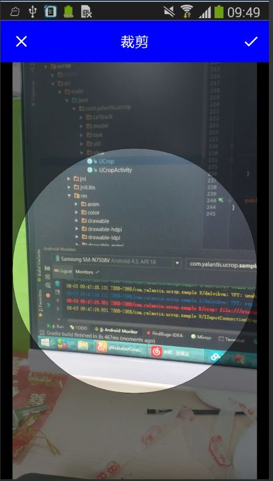

# PicCrop
对ucrop的封装工具类,让其使用更加快捷.

在ucrop 2.2.0(compile 'com.yalantis:ucrop:2.2.0')基础上封装,


如果以后ucrop以后升级,那么本工具类只需要改CropConfig里字段就可以.无需更改api.

甚至,切换其他图片裁剪框架,也是改方法内部实现即可,不用更换各处已调用的api.


## 说明

此项目从[https://github.com/glassLake/CropUtils](https://github.com/glassLake/CropUtils)迁移而来,已更新ucrop 依赖和api命名,原项目不再更新.


# uCrop主项目地址:

[https://github.com/Yalantis/uCrop ](https://github.com/Yalantis/uCrop)


# 效果图(标题栏和状态栏颜色均可自定义)

## 通用裁剪界面


 


## 头像裁剪框

 

# 封装的api

``` java

public static void cropFromGallery(Activity context)
public static void cropFromCamera(Activity context)

  
 //从图库中选头像
public static void cropAvatarFromGallery(Activity context)
public static void cropAvatarFromCamera(Activity context)

  
//需要自定义设置时使用
public static void cropFromGallery(Activity context,CropConfig config,int type)
public static void cropFromCamera(Activity context,CropConfig config,int type)
  

public static void onActivityResult( int requestCode, int resultCode, Intent data,Activity context, CropHandler cropHandler)

  
//回调接口
public interface CropHandler {
        void handleCropResult(Uri uri,int tag);
        void handleCropError(Intent data);
    }
```


# 使用

## 拷贝本工具类并添加gradle:

`compile 'com.yalantis:ucrop:2.2.0'`

若主项目有更新,请自行更新.


## 代码里

点击选择图片或拍照的地方调用cropFromxxx,

裁剪头像用cropAvatarFromxxx


在activity的onActivityResult里调用

`handleResult(this,cropHandler,requestCode,resultCode,data);`

注意无需预先对intent做为空的判断.


tag字段用于同一个页面多个地方接收裁剪图片的区分,如无需要,不必设置.


# 混淆

-dontwarn com.yalantis.ucrop**
-keep class com.yalantis.ucrop** { *; }
-keep interface com.yalantis.ucrop** { *; }


# 相关

[本工具类介绍blog地址](http://blog.csdn.net/hss01248/article/details/52124075)

[图片加载框架Fresco的封装工具类FrescoUtils](https://github.com/glassLake/FrescoUtlis)
